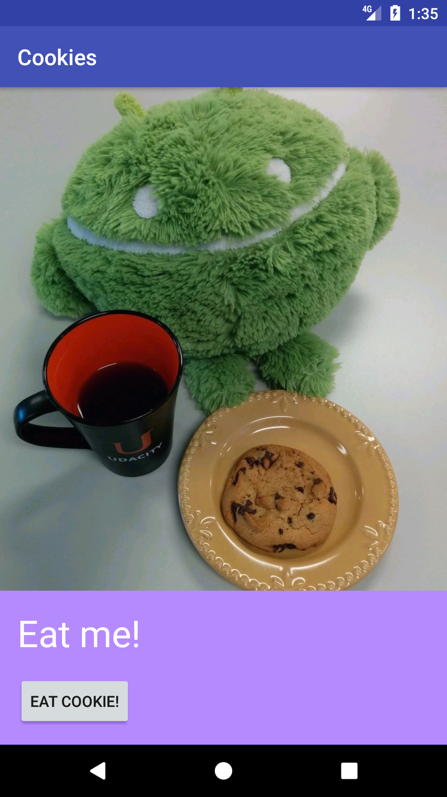

#Let's Eat Cookies!

A fun app that demonstrates the basics of Android app development. Linear layouts, button click handlers, ImageViews, and TextViews.

Toggles between two image states.

<img src="screenshots/full.png" width="350"
