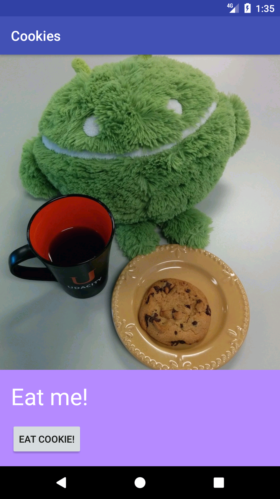
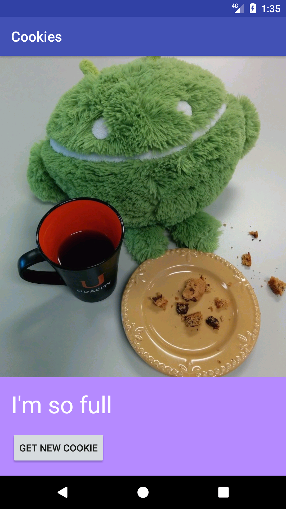

# Let's Eat Cookies!

A fun app that demonstrates the basics of Android development with Java. Linear layouts, button click handlers, ImageViews, and TextViews.

Toggles between two image states.

